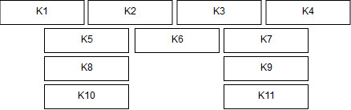
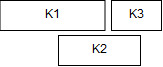
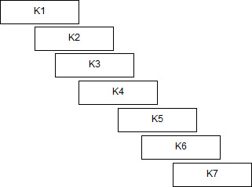

## <u>Αλγόριθμοι και πολυπλοκότητα: 2η σειρά γραπτών ασκήσεων</u>

-----

**<u>Ονοματεπώνυμο:</u>** Τσαγκαράκης Στυλιανός **<u>ΑΜ:</u>** 03115180

---

### <u>Άσκηση 1: Επιλογή και κάλυψη μαθημάτων</u>  

#### (α) Επιλογή μαθημάτων 

##### (α.1)

Στα παρακάτω ερωτήματα, αντιμετωπίζω τις "ισοπαλίες" με βάση τη χρονική προτεραιότητα. Δουλεύω με όποιο στοιχείο συναντήσω πρώτο που πληροί τα κριτήρια. 

1. **Λιγότερες επικαλύψεις**:

   Δίνει λάθος αποτέλεσμα, αντιπαράδειγμα:
   

   Θα επιλέγαμε αρχικά το Κ6, μετά Κ1 και στο τέλος Κ4. Άρα **3 μαθήματα.**
   Βέλτιστη λύση: **4 μαθήματα**

2. **Μεγαλύτερη διάρκεια**
   Δίνει λάθος αποτέλεσμα, αντιπαράδειγμα:
   

   Επιλέγουμε το Κ1, μετά το Κ2 οπότε μένει το Κ3. Άρα **1 μάθημα.**
   Βέλτιστη λύση: **2 μαθήματα.**

3. **Περισσότερες επικαλύψεις**
   Δίνει λάθος αποτέλεσμα, αντιπαράδειγμα:
   

   Επιλέγουμε κατά σειρά Κ4, Κ3, Κ5, Κ2, Κ7 και η τελική λύση είναι Κ1, Κ7. Άρα **2 μαθήματα**.
   Η βέλτιστη λύση είναι Κ1,Κ4,Κ7, **3 μαθήματα.**

##### (α.2) 

Για την λύση του προβλήματος θα χρησιμοποιήσουμε ΔΠ. 
Έστω n τα μαθήματα.
Φτιάχνουμε ένα πίνακα A μήκους n στον οποίο  θα αποθηκεύουμε τις διδακτικές μονάδες ($w_i$) που θα έχουμε μαζέψει μέχρι το μάθημα $ i \leq n$. 

Ο πίνακας Α γεμίζει ως εξής: $ Α[i] = A[k]+w_i, k < i \leq n$  έτσι ώστε το μάθημα i να μην επικαλύπτεται με το μάθημα k. Αλλιώς $Α[i] = w_i$.
**Πολυπλοκότητα:** $Ο(n^2)$ καθώς $\forall i$ μπορεί να χρειαστεί να πάμε μέχρι την αρχή των μαθημάτων για να βρούμε ένα μάθημα με το οποίο δεν υπάρχει επικάλυψη.  

#### (β) ΔΣ Φοιτητικού Συλλόγου

Ο αλγόριθμός μας είναι άπληστος με άπληστο κριτήριο την επίλογή του μαθήματος με τις περισσότερες επικαλύψεις. 
Εφόσον έχουμε πρόγραμμα θεωρώ πως τα μαθήματα είναι ταξινομημένα στο χρόνο. Σε κάθε άλλη περίπτωση θα χρησιμοποιούσα Quicksort με κόστος στην πολυπλοκότητα $O(N \log N ).$
Ο αλγόριθμος έχει ως εξής:
Αν δεν υπάρχουν επικαλύψεις (ή άλλα μαθήματα για ενημέρωση) τότε είμαστε υποχρεωμένοι να επισκεφθούμε τα Νέα Κτήρια.
Αν υπάρχουν επικαλύψεις: 

1. Επιλέγουμε το πρώτο (χρονικά) μάθημα. Έστω $[s_1, f_1) = D_1$.
2. Ψάχνουμε μαθήματα  $[s_i, f_i)$ τέτοια ώστε  $s_i \in D_1$.
3. Επιλέγουμε το πρώτο (χρονικά) στοιχείο στο παραπάνω διάστημα. Έστω μάθημα με $[s_k, f_k) = D_2$ με $s_i \leq s_k$.
4. Αν $f_k \leq f_i$ περιορίζουμε την αναζήτηση στο $D_2$ αλλιώς κάνουμε αναζήτηση στο $[s_k, f_i)=D_3$.
5. Επαναλαμβάνουμε τα βήματα 1 - 4 μέχρι να εξαντλήσουμε την αναζήτηση στο $D_2$.
6. Μόλις βρούμε όλα τα στοιχεία στο $D_2$ κρατάμε την στιγμή $s_k$ που τότε θα πρέπει να πάμε στα Νέα Κτήρια.
7. Αν δεν έχουμε ενημερώσει όλα τα μαθήματα και έχουμε εξαντλήσει την αναζήτηση στο $D_2$ τότε βρίσκουμε το επόμενο μάθημα που έχει $s_i \geq f_k$ και επαναλαμβάνουμε τα βήματα 1-6 μέχρι να μην υπάρχουν άλλα μαθήματα.

Αν N ο αριθμός των μαθήματων, τότε η **πολυπλοκότητα** του αλγορίθμου είναι $O(N)$ γιατί διατρέχουμε μια φορά όλα τα μαθήματα καθώς προχωράμε μόνο μπροστά στο χρόνο. 
Έστω ότι ο παραπάνω άπληστος αλγόριθμος είναι ορθός στις i πρώτες στιγμές. 
Α.ν.δ.ο. είναι **ορθός** στις i+1 πρώτες χρονικές στιγμές.
Έστω μια βέλτιστη επιλογή χρόνων μέχρι τη χρονική στιγμή $t_i$. Οπότε ο αλγόριθμός μας θα επιλέξει να ενημερώσει μια επόμενη στιγμή $t_{i+1}$. Και έστω μια άλλη χρονική στιγμή $t'_{i+1}$. 
Σίγουρα θα ισχυει $t'_{i+1} > t_i$ διότι #$t_k, k \in [1,i]$ είναι οι λιγότερες δυνατές μέχρι να ενημερώθούν όλα τα μαθήματα από 1 μέχρι j.
Στο $t_{i+1}$ ενημερώνουμε επιπλέον $λ$ μαθήματα. Αυτό σημαίνει ότι $t_{i+1} \geq s_λ \geq s_{λ-1} \geq ...$. Αφού και τα λ μαθήματα πρέπει να έχουν ήδη αρχίσει και $t_{i+1} < min(f_i), i \in (1,λ)$, διότι κανένα από αυτά δεν μπορεί να έχει τελειώσει. 
Αν $t'_{i+1} > min(f_i) $, αδύνατον γιατί θα χάναμε ένα μάθημα. 
Αν $t'_{i+1} < s_λ$ τότε σημαίνει πως θα ενημερώναμε $λ-1$ μαθήματα και θα χρειαζόταν να πάμε μια παραπάνω φορά για να ενημερώσουμε το $λ$.

**Βελτιστότητα:**
Έστω G ο αλγόριθμος μας, βέλτιστος για $\leq n$ μαθήματα.
Θ.δ.ο. είναι βέλτιστος για τα $n+1$.
Έστω $C'$ άλλος βέλτιστος αλγόριθμος.
Ο G επιλέγει να πάει την $t_1$ και επισκέπτεται k μαθήματα.
$G(A) = 1 + G(A_1)$ με $Α_1 = \big\{i : s_i > t_i \big\}$.
O $C’$ επιλέγει την $t'_1 \leq t_i$.
Άρα $C'(A) = 1 + C'(A’_1)$, $A'_1 = \big\{i : s_i > t'_i \big\}$.
Ισχύει: $A’_1 \supseteq A_1$ 
Άρα 
$$
C'(A'_1) \geq G(A_1) \rightarrow 1+ C'(A'_1) \geq 1 + G(A_1) \rightarrow C'(A) \geq G(A)
$$
Παρακάτω και ψευδοκώδικας για την άσκηση:

```c
int inform_courses (courses, ind_start, end, start, finish) {
	if (courses in [start, finish) == empty || ind_start == end)
        return start
    st = courses[ind_start].s
    fin = courses[ind_start].f
   	courses.delete(ind_start)
    return inform_courses(courses, ind_start+1, end, st, min(fin,finish) )
}
```

---

### <u>Άσκηση 2: Τηλεπαιχνίδι</u>

Θα χρησιμοποιήσουμε ένα άπληστο αλγόριθμο με 2 άπληστα κριτήρια. 
**Κριτήριο 1:** Προσπαθούμε να σπάμε κουτιά με μεγάλη αξία.
**Κριτήριο 2:** Δεν σπαταλάμε μεγάλης δύναμης σφυριά σε μικρής δύναμης κουτιά.

Ουσιαστικά έχουμε το μέγιστο δυνατό κέρδος με τη μικρότερη δυνατή “σπατάλη” δύναμης.
Ταξινομούμε με Quicksort τα κουτιά σε φθίνουσα σειρά $v_i$. 
Για κάθε κουτί i αντιστοιχούμε το σφυρί με min $f_j$ ώστε $f_j > p_i$.
Αν δεν υπάρχει τέτοιο σφυρί τότε πάμε στο επόμενο κουτί.

**Ορθότητα:**
Έστω G ο αλγόριθμός μας και C ο αλγόριθμος για την βέλτιστη λύση του προβλήματος.
Έστω ότι και οι δυο αλγόριθμοι έχουν την ίδια λύση μέχρι το κουτί $i$. Έστω $f_{i+1}$ η επιλογή του G και $f’_{i+1}$ του C.
Έστω $f_{i+1} \leq p_i < f’_{i+1}$. Άτοπο, καθώς ο G θα είχε διαλέξει $f_{i+1} \geq p_i$.
Έστω $f_{i+1} > p_i \geq f’_{i+1}$. Μπορώ να αλλάξω το $f'_{i+1}$ με το $f_{i+1}$ χωρίς να μειωθεί το κέρδος.

**Πολυπλοκότητα:**
Quicksort $\rightarrow O(n \log n)$.
Αναζήτηση σωστού $p_i$ για κάθε $f_i$. Μπορούμε να χρησιμοποιήσουμε δέντρο δυαδικής αναζήτησης όπου η εύρεση, η εισαγωγή και η εξαγωγή στοιχείου γίνεται σε $O(\log n)$.
Τελικά έχουμε $O(n \log n)$.

-----

### <u>Άσκηση 3: Αναμνηστικά</u>

Για την λύση του προβλήματος χρησιμοποιούμε δυναμικό προγραμματισμό. 
Χρησιμοποιούμε δύο πίνακες (Α,Β). Ο Β χρησιμοποιείται για να βρούμε τη βέλτιστη λύση για κάθε χώρα ενώ ο Α θα μας δώσει το τελικό αποτέλεσμα.
Ισχύει: $B_{\{k_i \times C \}}$ και $A_{\{C\}}$ όπου $k_i$ τα αναμνηστικά της κάθε χώρας i και n όλες οι χώρες που θα επισκεφθούμε.
Ισχύει επίσης $\forall  x: B[i,j] = max \{p_{xi}, B[i-1, j]\} $ αλλιώς $B[i-1,j] = -1$.
Το -1 δηλώνει ότι δεν μπορούμε να αγοράσουμε το συγκεκριμένο αναμνηστικό διαθέτοντας j χρήματα.
Με λίγα λόγια, το βέλτιστο $p_{xi}$ για κάθε χώρα x έχοντας εξετάσει τα πρώτα i αναμνηστικά, είναι το το μεγαλύτερο εκ δυο επιλογών: 

- Το $p_{xi}$ αν αγοράσω το αναμνηστικό i. 
- Αν μπορώ να πάρω κάποιο προηγούμενο αναμνηστικό με μεγαλύτερη συναισθηματική αξία.

Αφού γεμίσουμε τον Β κρατάμε την τελευταία σειρά του και την βάζουμε στον Α.
Για την κάθε επόμενη χώρα ξαναγεμίζουμε τον Β χρησιμοποιώντας τον Α τώρα.
Αν δε μπορούμε να το αγοράσουμε, δηλαδή: 

- $c_{yi} > j$ ή
- $A[j-c_{yi}] = -1 $

Τότε $Β[i,j] = -1$. 
Αν μπορούμε να το αγοράσουμε τότε:
$$
Β[i,j] = max\{p_{yi}+A[j-c_{yi}], B[i-1,j] + A[j-c_{yi}]\}
$$
Η τελευταία σειρά του πίνακα B μπαίνει στον πίνακα Α.
Η διαδικασία αυτή επαναλαμβάνεται μέχρι να επισκεφθώ όλες τις χώρες.
Το **βέλτιστο** αποτέλεσμα θα βρίσκεται στο στοιχείο $A[C]$. 

**Πολυπλοκότητα:** $ Ο \big(  C*\sum_{i=1}^{n}{k_i}  \big) $. Δηλαδή το πλήθος των αναμνηστικών όλων των χωρών επί C, καθώς ελέγχουμε κάθε αναμνηστικό με κάθε πιθανό $j \in [1,C]$.

----

### <u>Άσκηση 4: Σοκολατάκια</u>

Περιορισμοί του προβλήματος:

- Δεν μπορούμε να επιλέξουμε κουτιά με τον ίδιο τύπο απο σοκολατάκια
- Πρέπει να τρώμε από κουτιά σε αύξουσα σειρά.

Αρχικά ταξινομούμε (Quicksort) τα κουτιά με βάση το πλήθος των σοκολατακίων που περιέχουν, κρατώντας όμως τη θέση του καθένος. Ουσιαστικά δεν αναδιατάσουμε τα κουτιά.

Φτιάχνουμε ένα πίνακα ΔΠ, με n γραμμές και Q στήλες. 
Κάθε γραμμή αναπαριστάται με ένα κουτί από σοκολατάκια. $1^η$ γραμμή το κουτί με τα λιγότερα σοκολατάκια, ... ,  $n$-οστή γραμμή το κουτί με τα περισσότερα σοκολατάκια.

Σε κάθε στοιχείο του πίνακα θα αποθηκεύουμε τον ελάχιστο χρόνο που κάναμε για να φάμε j σοκολατάκια έχοντας ανοίξει τα πρώτα i κουτιά. 
Επίσης θα αποθηκεύουμε τη θέση και τον τύπο σοκολάτας του τελευταίου κουτιού που μόλις επισκεφθήκαμε.
Γεμίζουμε την πρώτη γραμμή του πίνακα ως εξής: $Α[0,j] = \begin{cases} \big|p-i\big|, j \leq q_i \\ -1, otherwise \end{cases}$.

Ο υπόλοιπος πίνακας θα συμπληρώνεται ως εξής:
$$
A[i,j]=
\begin{cases}
min\big\{A[i-1,j-q_i]+\big|prev-i\big|, A[i-1. j]\big\}, if \rightarrow j >q_i\\
min\big\{A[i-1,j], \big|prev-i\big|\big\}, if \rightarrow j \leq q_i\\
\big|prev-i\big|+A[i-1,j-q_i],if \rightarrow A[i-1,j] == -1\\
A[i-1,j], if \rightarrow A[i-1,j-q_i] == -1\\
-1,otherwise
\end{cases}
$$
To prev είναι το προηγούμενο κουτί από σοκολατάκια που έχω φάει στο οποίο αποθηκεύεται στον πίνακα μαζί με τα ελάχιστα κόστη. Κάθε ελάχιστο κόστος θα αποθηκεύει ποιό κουτί άνοιξα τελευταίο.

Αν άθροισμα = min $\rightarrow$ prev = η θέση του κουτιού που ανοίξαμε στην γραμμή i (αρχική θέση, η ταξινόμηση δεν επηρέασε θέσεις). 
Αντίθετα αν $A[i-1,j]$ = min $ \rightarrow$ prev = αυτό που ήταν και από πάνω.
Αν ένα στοιχείο δεν έχει prev $ \rightarrow$ prev = p (κουτί εκκίνησης).
Επίσης κάποιο άθροισμα μπορεί να μην είναι δυνατό αν τα δυο διαδοχικά κουτιά ανήκουν στην ίδια ομάδα. Σε αυτή την περίπτωση παίρνουμε το $A[i-1,j]$ ή θα είναι δυνατό εάν και το $A[i-1,j] = -1$.

Ο αλγόριθμός μας είναι **σωστός** καθώς σε κάθε βήμα που κάνουμε, με δεδομένα τα κουτιά που έχουμε ανοίξει, επιλέγουμε τη διαδρομή που μας δίνει το ελάχιστο κόστος. 
Επίσης η αύξουσα σειρά χωρητικότητας με την οποία παίρνουμε τα κουτιά μας διασφαλίζει ότι δεν χάνουμε κάποια διαδρομή ανοίγματος κουτιών. Αυτό συμβαίνει γιατί αν σε ένα βήμα του αλγόριθμου επιλέξουμε βέλτιστη λύση η οποία καταλήγει στο κουτί i  με ποσότητς $q_i$ τότε για το επόμενο κουτί που θα πάμε να βάλουμε στον πίνακα ΔΠ, έστω j, θα ξέρουμε ότι $q_j > q_i$ και επομένως δεν υπάρχει τρόπος να ανοίξω το j κουτί χωρίς να ανοίξω το i και τα προηγουμενά του κρατώντας τον συνολικό αριθμό σοκολατακίων που τρώω σταθερό.

Η λύση του προβλήματος θα βρίσκεται στο στοιχείο $A[n,Q]$ του πίνακα.

**Πολυπλοκότητα:** Για να συμπληρώσουμε τον πίνακα θέλουμε χρόνο $O(nQ)$ και για ταξινόμηση θέλουμε $O(n \log n).$ Άρα συνολικά θέλουμε $O\big(n(\log n + Q)\big)$.

----

### <u>Άσκηση 5: Πομποί και δέκτες</u> 

Θεωρούμε για κάποια θέση πομπων-δεκτών το μέγεθος $D(i)$ ως το πλήθος των πομπών μείον το πλήθος των δεκτών στο $[1,i]$. Μια δομή πομπων-δεκτών είναι σωστή αν και μόνο αν ισχύει για κάθε $i \in (1,2,...,n)$, $S(i) \geq 0 $ και $S(n) = 0.$

**Αλγόριθμος:**

- Αρχικοποιούμε ένα κενό min-heap Q.
- Για $i = 1, 2, ... , n$
  - Θεωρούμε τον $i$ ως δέκτη, προσθέτουμε $R_i$ στο συνολικό κόστος και βάζουμε το ζεύγος $(T_i-R_i, i) $ στο Q.
  - Αν $S(i) < 0$ αφαίρεσε από το Q το δέκτη με το ελάχιστο $T_j - R_j$, μετέτρεψέ τον σε πομπό και αύξησε το συνολικό κόστος κατά $T_i - R_j$.

**Πολυπλοκότητα**: $Ο(n \log n)$ αφού έχουμε n βήματα και σε κάθε βήμα κάνουμε $O(\log n)$ για εισαγωγή - εξαγωγή από το min-heap.

Έστω ότι έχουμε μια **βέλτιστη** έγκυρη ανάθεση στο διάστημα $[1,i]$. Α.ν.δ.ο. η λύση στο διάστημα $[1,i+1]$ είναι βέλτιστη.

- Αν ο $i$ είναι περιττός, δηλαδή έχουμε ένα παραπάνω πομπό μέχρι τώρα, η λύση είναι προφανώς βέλτιστη στο $[1,i+1]$ αφού τοποθετούμε δέκτη στο $i+1$, άρα $S(i+1) = 0$ αφού $S(i) = 1$.
- Αν ο $i$ είναι άρτιος, δηλαδή έχουμε για κάθε έγκυρη λύση στο $[1, i+1]$, $S(i) = 0$ ή $S(i) = 2$. Στην πρώτη περίπτωση είναι προφανές πως η λύση είναι η βέλτιστη. Στη δεύτερη έχουμε 2 παραπάνω πομπούς. Μετατρέποντας ένα πομπό σε δέκτη έχουμε $S(i) = 0$. Η θέση είναι αυτή με το ελάχιστο $T_j - R_j$ καθώς προσθέτουμε το ελάχιστον δυνατό κόστος (μετατρόπής) στο συνολικό κόστος ενέργειας.