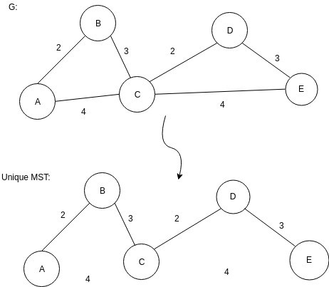
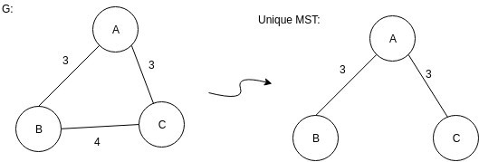

## <u>Αλγόριθμοι και πολυπλοκότητα: 2η σειρά γραπτών ασκήσεων</u>

-----

**<u>Ονοματεπώνυμο:</u>** Τσαγκαράκης Στυλιανός **<u>ΑΜ:</u>** 03115180

---

### <u>Άσκηση 1: Μακρύτερο μονοπάτι σε δέντρο</u>  

Έστω δέντρο $T(V,E)$ και το βάρος κάθε κορυφής $w(u) \in \Z$. 

Ο αλγόριθμος για να υπολογιστεί το μακρύτερο μονοπάτι που ζητάμε έχει ως εξής: 
Ξεκινάμε από τη ρίζα και εκτελώντας αναδρομικά σε κάθε παιδί τον ίδιο αλγόριθμο. Κάθε φορά που βρίσκουμε μεγαλύτερο μονοπάτι το κρατάμε.
Στον πατέρα επιστρέφεται το μεγαλύτερο μονοπάτι που μπορεί να σχηματιστεί αν το παιδί ήταν η αρχή αυτού το μονοπατιού. Ο πατέρας κρατάει από όλα τα παιδιά του τα 2 μεγαλύτερα μονοπάτια που του γυρνάνε και συγκρίνει το μονοπάτι που δημιουργείται αν ήταν μέσο αυτού  με ένα γενικότερο μονοπάτι που κρατάμε πάντα το μέγιστο.

Παρακάτω και ψευδοκώδικας:  

```c
max_path = 0

main
    max_path = longest(root_of_tree)
    print(max_path)

longest(node k)
    max1 = 0
	max2 = 0
	for all kids n of k
    	temp = longest(n)
		if temp > max1
			max2 = max1
			max1 = temp
		else if max2 < temp
			max2 = temp
	val = k.value + max1 + max2 
	if val > max_path
		max_path = val
    return k.value + max1
```

**Πολυπλοκότητα:** Γραμμική, $Ο(V+E)$, αφού επισκεπτόμαστε κάθε κόμβο και κάθε ακμή μόνο μια φορά.
**Ορθότητα:** 
Έστω $ε = R+\pi_j + \pi_i$ το μονοπάτι που έχει βρει ως βέλτιστο ο αλγόριθμός μας ($C$). Με $\pi_j \leq \pi_i$
Έστω $ε΄$ το μονοπάτι που έχει βρει ένας άλλος βέλτιστος αλγόριθμος ($C^*$)
Υπάρχουν οι εξής περιπτώσεις:

- Το $ε΄$ να περνάει από το R. Έστω $ε΄ = R + \pi_j'+ \pi_i'$ με $\pi_j' \leq \pi_i'$. Ο $C^*$ βρίσκει καλύτερο μονοπάτι αν $\pi_j + \pi_i \leq \pi_j' + \pi_i'$. Όμως ο αλγόριθμός μας επιλέγει πάντα τα 2 μεγαλύτερα μονοπάτια άρα $\pi_j \geq \pi_j'$ και  $\pi_i \geq \pi_i'$. Άρα δεν βρίσκει καλύτερο μονοπάτι (άτοπο).
- Το $ε΄$ να μην περνάει από το R αλλά να περνάει από ένα παιδί η πρόγονο του R, έστω Κ. Οπότε το $ε΄$ θα είναι βέλτιστο για το υποδέντρο με ρίζα Κ. Όμως $ε = max\{ ε_i\}$ με $ε_i$ όλα τα μονοπάτια που σχηματίζονται με ή χωρίς το R. 

### <u>Άσκηση 2: Μια συνάρτηση κόστους σε κατευθυνόμενα γραφήματα (DPV 3.25)</u>  

#### (α) Σε DAG

Έστω μια κορυφή u. 
Τότε όλες οι κορυφές που είναι προσπελάσιμος από τη $u$ είναι οι εξής:

- Η ίδια κορυφή $u$.
- Οι κορυφές με τις οποίες συνδέεται με ακμή $ u \rightarrow v_i: v_1, ... , v_d$ .
- Οι κορυφές που είναι προσπελάσιμες από τις κορυφές $ v_i$. 

Χρησιμοποιώντας αυτά τα δεδομένα υλοποιούμε τον αλγόριθμο που γεμίζει το γράφημα από τα φύλλα προς την ρίζα (αναδρομικά, ξεκινώντας από την ρίζα).
Κάθε κόμβος χαρακτηρίζεται 'Α' (ανεξερεύνητος) μέχρι να τον επισκεφθούμε, οπότε αλλάζει σε 'Ε' (εξερευνημένος). Ξεκινώντας από την ρίζα εκτελούμε αναδρομικά τον αλγόριθμο στους κόμβους παιδιά, μέχρι να φτάσουμε σε φύλλο. Τα φύλλα επιστρέφουν την τιμή τους και κάθε κόμβος επιστρέφει την μικρότερη τιμή που συνάντησε συμπεριλαμβανομένου και του εαυτού τους.

Παρακάτω ψευδοκώδικας για τον αλγόριθμο:

```c
for each u in V
	u.state = A
for each u in V
	if u.state = A
    	u.min = min_element(u)
        
min_element(node u)
	global_min = u
	for each kid k of u
		if k.state = A
			k.min = min_element(k)
		if global_min > k.min
			global_min = k.min
	return global_min
```

**Πολυπλοκότητα:** Γραμμική, $Ο(V+E)$,  αφού επισκεπτόμαστε κάθε κόμβο και ακμή μια φορά μόνο.
**Ορθότητα:** Όπως αναφέρθηκε παραπάνω όλες οι κορυφές που είναι προσπελάσιμος από τη u είναι οι εξής:

- Η ίδια κορυφή $u$.
- Οι κορυφές με τις οποίες συνδέεται με ακμή $ u \rightarrow v_i: v_1, ... , v_d$ .
- Οι κορυφές που είναι προσπελάσιμες από τις κορυφές $ v_i$, έστω $u_{i1},$ ... $,u_{in}$.

Με βάση αυτό ξεκινώντας από ένα κόμβο $u$ αναδρομικά φτάνουμε σε κάθε κόμβο προσπελάσιμο από αυτόν και τον χαρακτηρίζουμε εξερευνημένο (Ε). 
Έστω $k_i$ η τιμή που επιλέχθηκε από τον αλγόριθμό μας ($C$) για τον κόμβο $u$.
Έστω  $k_j$ η τιμή που επιλέχθηκε από έναν άλλο βέλτιστο αλγόριθμο για τον ίδιο κόμβο. Όμως $k_i = min \{u_1,$ ... , $u_d, u_{i1},$ ... $, u_{in}$ }. 
Άρα ισχύει: $k_j \geq k_i$.

#### (β) Εφαρμογή σε κάθε κατευθυνόμενο γράφημα.

Ο παραπάνω αλγόριθμος μπορεί να εφαρμοστεί σε κάθε κατευθυνόμενο γράφημα G χρησιμοποιώντας την έννοια των ΙΣΣ, μετατρέποντάς το δηλαδή σε DAG. Στο τέλος θα ενημερώσουμε όλους τους κόμβους του γραφήματος με βάση τους αντιπροσώπους των κλάσεων τους.
Συνεπώς αρκεί να ορίσουμε τον αλγόριθμο που μετατρέπει ένα οποιοδήποτε κατευθυνόμενο γράφο σε DAG. 

Παρακάτω ψευδοκώδικας για τον ζητούμενο αλγόριθμο:

```c
index = 0
S = empty array
for each vertex v in G do
      if (v.index is undefined) then
			strongconnect(v)
      end if
end for

function strongconnect(v)
      v.index = index
      v.lowlink = index
      index = index + 1
      S.push(v)
      v.onStack = true

      for each succesor w of v do
            if (w.index is undefined) then
                  strongconnect(w)
                  v.lowlink = min(v.lowlink, w.lowlink)
            else if (w.onStack) then
                  v.lowlink = min(v.lowlink, w.index)
            end if
      end for
      if (v.lowlink = v.index) then
            start a new strongly connected component
            repeat
                  w = S.pop()
                  w.onStack = false
                  add w to current strongly connected component
            while (w != v)
            output the current strongly connected component
      end if
end function

finMinVal(list SCC, list nodes)
	for all SCC:
        min = MAX_INT
        
    for all vertices k in SCC:
		temp = k.value
		if temp < min: 
			min =  temp
	
	nodes SCC[1].lowlink = min
end function

Correct_node_value(list_of_nodes)
	for all nodes in list_of_nodes:
		node.Cost = node.lowlink.Cost
end function

main()
	run strongconnect(V)
	run finMinVal(SCC, nodes)
	run algo_a(list_of_fathers)
	run Correct_node_value(list_of_nodes)
end function
```

**Πολυπλοκότητα:** Ο αλγόριθμος αυτός καλείται μια φορά για κάθε κόμβο και εξετάζει κάθε ακμή τo πολύ μια φορά. Άρα είναι γραμμικός ως προς τις ακμές και τους κόμβους του γράφου, δηλαδή: $Ο(V+E)$.
**Ορθότητα:**  Η ανάλυση της ορθότητας του παραπάνω αλγορίθμου στην ουσία υπάγεται στην ορθότητα του αλγορίθμου Tarjan. Ο προκείμενος αλγόριθμος κάνει αναδρομικές κλήσεις μέχρι που να φτάσει σε φύλλο ή σε κόμβο που δεν έχει επισκεφτεί ξανά. Αν ο διπλοεπισκεπτόμενος κόμβος ανήκει στο αναδρομικό μονοπάτι, αποθηκεύει σε μια μεταβλητή  lowlink, που αντιπροσωπεύει το index του πρώτου κόμβου που επισκέφτηκε στην συγκεκριμένη συνεκτική συνιστώσα και αποθηκεύει όσα στοιχεία ανήκαν σε αυτό το αναδρομικό μονοπάτι σε μια στοίβα. Όταν γυρίσει από όλες τις αναδρομικές κλήσεις όπου Index == lowlink δηλαδή είναι ο πατέρας της συνεκτικής συνιστώσας, τότε αποθηκεύει όλα τα στοιχεία ης στοίβας (τρέχουσα ΙΣΣ) σε μια νέα δομή που κρατάει όλες τις ΙΣΣ.


### <u>Άσκηση 3: Κλέφτες και Αστυνόμοι</u>  

Ο αλγόριθμος μας αποτελεί μια παραλλαγή του γνωστού αλγορίθμου λήψης αποφάσεων Minimax.

Αρχικά, με βάση τον γράφο του προβλήματος που μας δίνεται δημιουργούμε έναν γράφο με όλες τις πιθανές καταστάσεις του παιχνιδιού, δηλαδή φτιάχνουμε τον χώρο καταστάσεων. Κάθε κατάσταση κωδικοποιείται από μια τριάδα θέση κλέφτη, θέση αστυνομικού, επόμενος παίκτης. Ο χώρος καταστάσεων θα αποτελεί ένα δέντρο το οποίο θα έχει ρίζα την αρχική κατάσταση $(t,p,thief)$ γιατί πάντα παίζει πρώτος ο κλέφτης. 
Από εκεί και πέρα από κάθε κόμβο φτιάχνουμε τα παιδιά του ως εξής. Βρίσκουμε τους γείτονες (θεωρώντας ότι έχουμε το γράφο σε πίνακα γειτνίασης) και για κάθε γείτονα σε $Ο(1)$ αξιολογούμε αν αυτή η κατάσταση που δημιουργούμε είναι τερματική δηλαδή αν κάποιος κερδίζει και αποθηκεύουμε και ποιος κερδίζει. Ο κλέφτης κερδίζει όταν $t=d$ και ο αστυνομικός όταν $t=p$. Ακόμη χρησιμοποιούμε δύο σύνολα στα οποία κρατάμε ποιους κόμβους έχει επισκεφτεί κάθε παίκτης και σημειώνουμε με ισοπαλία την περίπτωση που ένα μονοπάτι μας οδηγήσει σε κόμβο που έχουμε επισκεφτεί ξανά. 

Επίσης όταν ο πατέρας βρει ένα παιδί στο οποίο κερδίζει ο παίκτης που παίζει δεν ψάχνει τα υπόλοιπα παιδιά καθώς δεν υπάρχει λόγος να κάνει διαφορετική κίνηση. Επίσης, γνωρίζουμε ότι για να μην υπάρξει ισοπαλία πρέπει κάθε παίκτης να χρησιμοποιήσει κάθε ακμή μια φορά. 

Ο κλέφτης μπορεί να πάει σε $Ο(|V|)$ θέσεις και ο αστυνομικός μπορεί να πάει σε όλες εκτός από το καταφύγιο d. Άρα $Ο(|V|-1)$ θέσεις. Επομένως, το σύνολο των δυνατών θέσεων θα είναι $Ο(V^2)$. 

Σε περίπτωση που φτάσουμε στο δέντρο του χώρου καταστάσεων σε μία κοινή κατάσταση(ίδιες θέσεις και ίδιος επόμενος παίκτης), τότε δεν συνεχίζουμε ,αφήνουμε τον κόμβο αυτόν ως φύλλο χωρίς όμως να αποτιμήσουμε άμεσα ποιος κερδίζει και βλέπουμε πως αποτιμάει ο αλγόριθμος μας τον κόμβο αυτόν κατά το τρέξιμο του και τον αποτιμάμε στο τέλος.Επομένως, το δέντρο του χώρου καταστάσεων θα έχει τόσους κόμβους. 

Ο αλγόριθμός μας θα παίρνει αυτό το δέντρο και θα επιλέγει ως εξής ποιος θα είναι ο τελικός νικητής του παιχνιδιού. Κάθε επίπεδο του δέντρου (οριζόντιο) ορίζεται ως επίπεδο
νίκης Κλέφτη ή Αστυνομικού. 

Το αρχικό επίπεδο αφού παίζει πρώτος ο κλέφτης θα είναι επίπεδο κλέφτη. Με βάση αυτό όλα τα υπόλοιπα θα πηγαίνουν εναλλάξ, δηλαδή το 2ο Αστυνομικού, το 3ο κλέφτη κλπ. Αυτό σημαίνει πως αν ο πατέρας ενός κόμβου είναι επίπεδο κλέφτη για παράδειγμα, τότε επιλέγεται το παιδί που είναι πιο συμφέρον για τον πατέρα, δηλαδή για τον κλέφτη στο παράδειγμα. Προφανώς  ως πιο συμφέρον μονοπάτι θεωρούμε το μονοπάτι που οδηγεί στη νίκη της εκάστοτε πλευράς. 

Έτσι ξεκινώντας από το επίπεδο του πιο απομακρυσμένου φύλλου του δέντρου ανατρέχουμε το δέντρο από κάτω προς τα πάνω και ενημερώνουμε κάθε κόμβο-πατέρα με την εξής λογική. Θεωρούμε ότι ο πατέρας είναι τύπου Κ. Αν έχει έστω και ένα παιδί το οποίο είναι νίκη κλέφτη τότε ενημερώνεται και ο ίδιος ως Κ. Αλλιώς επιλέγεται ως Ισοπαλία αν έχει τέτοιο παιδί και αν έχει μόνο παιδί νίκη Αστυνομικού τότε ενημερώνεται ως Α. Με αντίστοιχη λογική ενημερώνεται και αν το επίπεδο του είναι τύπου Α. Έτσι κάθε πατέρας ενημερώνεται ουσιαστικά αν μπορεί να οδηγήσει σε νίκη Αστυνομικού ή κλέφτη. Έπειτα ενημερώνουμε το επόμενο στάδιο κόμβων μέχρι να φτάσουμε στον αρχικό κόμβο. Ουσιαστικά, καθώς ο κλέφτης έχει την 1η κίνηση ο μόνος τρόπος για να χάσει ο κλέφτης (θεωρώντας ότι και οι δύο παίχτες παίζουν βέλτιστα) είναι όλα τα παιδιά της ρίζας να είναι τύπου Α (Αστυνομικού), δηλαδή να οδηγούν σε νίκη του αντιπάλου.Για τον αστυνομικό η νίκη του και το βέλτιστο παιχνίδι του εξαρτάται ουσιαστικά από τη διαμόρφωση της πίστας ή το λάθος του αντιπάλου, το οποίο αποκλείεται κιόλας σε αυτήν την περίπτωση. 

Ο αλγόριθμος αυτός εξετάζει κάθε κόμβο του δέντρου,δηλαδή κάθε πιθανή κατάσταση του χώρου καταστάσεων, ακριβώς μια φορά και επομένως έχει πολυπλοκότητα $Ο(V^2)$. Επομένως συνολική πολυπλοκότητα του αλγορίθμου θα είναι    ΟV 2    , όπου V ο αριθμός των κόμβων του αρχικού γράφου της πίστας του παιχνιδιού. 

### <u>Άσκηση 4: Το Σύνολο των Συνδετικών Δέντρων (ΚΤ 4.27 και ΚΤ 4.28)</u>

#### (α)

Έστω $T_1, T_2$ δυο διαφορετικά συνδετικά δέντρα και $e \in T_2 \backslash  T_1$  με $(T_2 \backslash T_1) = \emptyset$/

- $Τ_1 \cup \{ e\}$  περιέχει κύκλο C. Υπάρχει ακμή $e' \in C, e' \notin T_2$ , αλλιώς το $Τ_2$ περιέχει τον C.
- $(Τ_1 \backslash \{e\}) \cup \{e'\}$ είναι άκυκλο με $n-1$ ακμές $\Rightarrow$ Συνδετικό δέντxρο.

Εύρεση $e'$. 
Έστω $T_1, T_2$ και $e = \{u, v\}$.

- Σε $Ο(|V|)$ κάνουμε DFS από το $u$ στο $v$ στο δέντρο $Τ_1$ και βρίσκουμε μονοπάτι $P$ που τους συνδέει.
  - Για κάθε $e \in P$ ελέγχουμε σε $O(1)$ αν ανήκει στο $T_2$ και μόλις βρούμε $e \in P, e \notin T_2$ την αφαιρούμε. Συνολικά έχουμε $Ο(|V|)$.χ

#### (β)

Αρχικά θα δείξουμε ότι το γράφημα Η είναι συνεκτικό. Από τον ορισμό του Η, έχουμε ότι οι κορυφές του είναι όλα τα διαφορετικά συνδετικά δέντρα του αρχικού γραφήματος G και οι ακμές του είναι ανάμεσα σε δύο κόμβους, όταν τα συνδετικά δέντρα στα οποία αντιστοιχούν, διαφέρουν κατά μία ακμή στο αρχικό γράφημα. Το γράφημα G είναι συνεκτικό από την εκφώνηση. Έστω ότι το Η δεν είναι συνεκτικό, δηλαδή υπάρχει μια κορυφή η οποία αντιστοιχεί στο συνδετικό δέντρο $T_1$ και συγχρόνως δεν υπάρχει μονοπάτι από το υπόλοιπο γράφημα προς αυτήν. Αυτό σημαίνει δεν υπάρχει δέντρο $T_2$ το οποίο να διαφέρει κατά μία ακμή με το συνδετικό δέντρο $T_1$. Αυτό είναι άτοπο καθώς από το α), για κάθε συνδετικό δέντρο του G, μπορούμε να βγάλουμε μια ακμή e και να προσθέσουμε μία e' και να δημιουργήσουμε, ένα συνδετικό δέντρο $T_2$.

#### (γ)

γ) Για το γράφημα $E_1$ θεωρούμε τα δέντρα $Τ_1$, $Τ_2$ με το μέγιστο και ελάχιστο αντίστοιχα αριθμό ακμών του $E_1$, για να έχει λύση το πρόβλημα θα πρέπει $Τ_1E_1k$ και $T_2E_1k$. Υπολογίζουμε το σύνολο $S = Τ_1T_2E_1$. Αν δεν ισχύουν οι παραπάνω προϋποθέσεις τότε ο αλγόριθμος ανακοινώνει αποτυχία. Σε αντίθετη περίπτωση για κάθε   $e_S$, προσθέτουμε την ακμή $e$ στο $T_2$ αφαιρώντας την κατάλληλη ακμή από το    $T_2$ που δεν ανήκει στο $Τ_1$ μέχρι να γίνει $T_2, E_1$k. Ο αλγόριθμος ξεκινάει έχοντας $Τ_1E_1k$   και   $Τ_2E_1k$. Εφόσον κάθε φορά αλλάζουμε κατά μία ακμή και τα $Τ_1, Τ_2$ (αφαιρούμε απο $Τ_1$ και προσθέτουμε στο $Τ_2$) είναι σίγουρο πως θα έχουμε κάποια στιγμή k ακμές. Για να υπολογίσουμε το $Τ_1$     βάζουμε τις ακμές του $E_1$ πριν από του Ε2 και τρέχουμε Kruskal και έπειτα κάνουμε το ίδιο για τον υπολογισμό του $T_2$. Πληρώνουμε σε πολυπλοκότητα $Ο(|E|)$. Έπειτα τρέχουμε τον αλγόριθμο του β), που έχει πολυπλοκότητα $Ο(k|V|)$. Επομένως συνολική πολυπλοκότητα Ο(|E|+k|V|).

### <u>Άσκηση 5: Μοναδικότητα Ελάχιστου Συνδετικού Δέντρου</u> 

#### α) 

αντιπαράδειγμα



#### β)

Έστω Τ1, Τ2  δύο ΕΣD. Τότε Υ = Τ1  - Τ2  και Υ΄ = Τ2, Τ1. Παίρνουμε την ε που είναι η ακμή ελάχιστου βάρους και ανήκει στο σύνολο Υ U Υ΄ και χωρίς βλάβη της γενικότητας θεωρούmε ότι η ε ανήκει στο Τ1.  Αν προσθέσουμε την  ε  στο  Τ2   προκύπτει  κύκλος στον  οποίο  υπάρχει  ε΄  όπου  ανήκει  στο  Υ΄,  διότι  διαφορετικά  θα  υπήρχε  και  ο αντίστοιχος κύκλος στο Τ1.  Τότε όmως υπάρχει τοmή που την διασχίζουν οι ε,  ε΄ και $w(ε)$ μικρότερο ίσο με $w(ε΄)$.  Άρα καταλήγουμε σε άτοπο, διότι αν $w(ε)$  μικρότερο  βάρος(ε΄) το Τ2  δεν είναι ΕΣD και αν $w(ε)$  =  με  $w(ε΄)$ τότε αυτή η τομή διασχίζεται από δύο ελάχιστες ακμές (αίρεται η υπόθεση). 

Αντιπαράδειγμα:



#### γ)

Αναγκαία και ικανή συνθήκη αποτελεί: Dεν  υπάρχουν  στον  ίδιο  κύκλο  δύο  τομές  με  μη  μοναδικές ελάχιστες  ακμές  ή  κύκλοι  με  μόνο  δύο  ακμές  οι  οποίες  είναι  ισοβαρείς  .

Ικανή:

΄Εστω  Τ1,  Τ2   δύο  ΕΣD.  Τότε  Υ  =  Τ1   -  Τ2   και  Υ΄  =  Τ2,  Τ1.   Παίρνουμε  την  ε  που  είναι  η  ακμή ελάχιστου βάρους και ανήκει στο σύνολο Υ U Υ΄ και χωρίς βλάβη της γενικότητας θεωρούμε ότι η ε ανήκει στο Τ1.  Αν προσθέσουμε την ε στο Τ2  προκείπτει κύκλος στον οποίο υπάρχει ε΄ όπου ανήκει στο Υ΄, διότι διαφορετικά θα  υπήρχε  και  ο  αντίστοιχος  κύκλος  στο  Τ1.  Τότε  όμως  υπάρχει  τομή  που  την  διασχίζουν  οι  ε,  ε΄  και  βαρος(ε) μικρότερο ίσο με βάρος(ε΄).  ΄Αρα καταλήγουμε σε άτοπο, διότι αν βαρος(ε)  μικρότερο  βάρος(ε΄) το Τ2  δέν έιναι ΕΣD και αν βαρος(ε)  =  βάρος(ε΄) τότε έχουμε δύο περιπτώσεις:
α)  υπάρχει  α  με  βάρος  μεγαλύτερο  από  βαρος(ε).  Τότε  την  αφαιρούμε  και  καταλήγουμε  σε  ένα  Τ3  με  μικρότερο συνολικό βάρος από το Τ2, άρα Τ2  δεν είναι ΕΛΣ.
β)  Dεν  υπάρχει  α  με  βάρος  μεγαλύτερο  από  βάρος (ε).   Τότε  θα  υπάρχει  ακμή  α  όπου  βάρος (α)  =  βάρος (ε)  = βάρος(ε΄) άτοπο (αίρεται η αρχική μας συνθήκη, υπάρχουν δύο τομές με μη μοναδικές ελάχιστες ακμές) ή ο κύκλος αποτελείται από δύο ισαβαρείς ακμές (αίρεται η αρχική συνθήκη). 
Αναγκαία:

Έστω  ότι  υπάρχει  μοναδικό  ΕΣD  αλλά  στο  γράφημά  μας  G  αίρει  την  αρχική  μας  συνθήκη.   Τότε  θα υπάρχει κύκλος με δύο διαφορετικές τομές όπου η κάθε μία έχει δύο ίσες ελάχιστες ακμές να την διασχίζουν,  ε, ε΄  και  α,  α΄  αντίστοιχα.   Χωρίς  βλάβη  της  γενικότητας  υποθέτουμε  ότι  βάρος(ε)  =  βάρος(ε΄)  μικρότερο  ίσο  των βάρος(α) = βάρος(α΄).  Ακόμα το Τ για λόγους συνδετικότητας θα πρέπει να έχει τουλάχιστον μία από ε,ε΄ και μία από α,α΄, οπότε χ.β.γ.  ας υποθέσουμε ότι οι ε,α είναι μέρος του Τ . Αν οι ε΄,α΄ δεν ανήκουν στο Τ.
Τότε αν προσθέσουμε τις ε΄, θα δημιουργηθεί ο κύκλος που συνυπάρχουν και οι τέσσερεις ακμές, οπότε θα αφαιρέσουμε τις ε,α και θα καταλήξουμε σε ένα δεύτερο ΕΛΣ άτομο (λόγω μοναδικότητας του Τ). Αν ε,ε΄,α ανήκουν στο  Τ.  Τότε  προσθέτουμε  το  α΄  θα  δημιουργηθεί  ο  κύκλος  που  συνυπάρχουν  και  οι  τέσσερεις  ακμές  και  έτσι καταλήγουμε στην προηγούμενη περίπτωση άρα άτομο.  Αντίστοιχα και για ε,ε,α΄.

#### δ) 

Στον αλγόριθμο μας θέλουμε να ελέγξουμε την παραπάνω αναγκαία και ικανή συνθήκη. Αρχικά θα υπολογίσουμε ένα ελάχιστα συνδετικό δέντρο Τ. Για τον υπολογισμό του τρέχουμε τον αλγόριθμο του Kruskal με πολυπλοκότητα $Θ(|E|log|E|)$. Έπειτα για κάθε κόμβο v του δέντρου κάνουμε DFS. Κατά το DFS για κάθε κόμβο u που επισκέπτεται το DFS αποθηκεύουμε την πιο βαριά ακμή στο μονοπάτι από το v στο u, σε έναν πίνακα $maxw[v][u]$. Αφού το κάνουμε αυτό, για κάθε ακμή (a,b) που δεν ανήκει
στο δέντρο ελέγχουμε αν το βάρος της είναι μικρότερο η ίσο από το $wmax(a,b)$ και αν είναι επιστρέφει ότι ο γράφος δεν έχει μοναδικό ΕΣΔ. Δηλαδή βρήκαμε έναν κύκλο $(Τ,e)$ στον οποίο η ακμή  e που δεν ήταν στο δέντρο  Τ δεν ήταν η μέγιστη. Για το DFS πληρώνουμε $O(|V|)$ και το εκτελούμε $|V|$ φορές.
Για τον τελικό έλεγχο πληρώνουμε $Ο(|Ε|)$. Επομένως συνολική πολυπλοκότητα  $O(V^ 2 * E \log E)$

